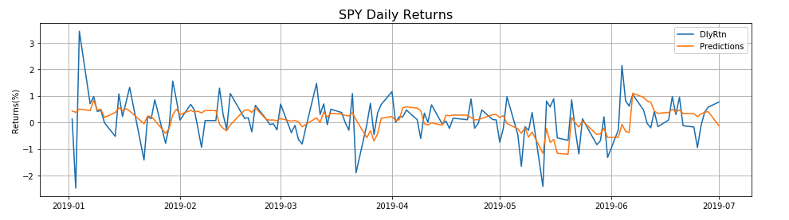

# How to Make More Money Than The Average Bear
## The Question:
Can machine learning or a known trading algorithm imporve upon the performance of the S&P 500 by only investing in a small subset of the sectors that comprise this benchmark equity index?
## The Data 
- Stock data from Yahoo Finance on the S&P 500 and 9 sectors 
- Data ranging from July 1, 1999 to July 1, 2019
- **Sectors Include:** 
  - XLB: Materials
  - XLE: Energy 
  - XLF: Finacials 
  - XLI: Industrials 
  - XLK: Tech
  - XLP: Consumer Staples 
  - XLV: Health Care
  - XLY: Consumer Discretionary 
  - XLU: Utilities 
  
  **An approximate breakdown of sector allocation**
 
## Sector Rotation and Rebalncing
 - Sector rotation is an investment strategy that involves moving money from one industry sector to another. In this case based on a weighted score from our trading algorithm or the best predicted monthly return based on our LSTM model.
- Rebalancing involves investing the same amount of money in a number of sectors and then selling the ETFs at the end of each month and using the capital to buy equal amounts in each of the sectors.  
## LSTM Model 
- An LSTM (Long Short Term Memory) Model is a type of recurrent neural network capable of learning order dependence in sequence prediction problems 
- Training Data: Daily Returns 7/1/1999 - 12/31/2018
- Testing Data: Daily Returns 1/2/2019 - 7/1/2019

The actual daily returns from the test data vs the predictions for the S&P 500. As you can see the model fails to capture the everyday volatility of the stock market but seems to be able to follow the overall trend with some accuracy. 

The daily returns aggregated into monthly returns on the last trading day of the month. As you can see the prediction is off by less than 2% in all cases and always captures the correct direction of the market. 

